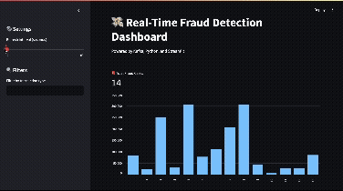

# 💳 Kafka Fraud Detection
This project simulates real-time transaction streaming using Apache Kafka. A Python Kafka Producer reads sample transactions and sends them to a Kafka topic for fraud analysis.

<p align="center">
  
</p>


## 📦 Features

- Stream transaction data from a CSV file  
- Simulated real-time Kafka Producer using `kafka-python`  
- Easy to extend for real-time fraud detection or consumer logic

## 🚀 Getting Started

### Prerequisites

- Python 3.8+
- Apache Kafka (running locally on `localhost:9092`)
- Install dependencies:

```bash
pip install pandas kafka-python
````

### Run the Producer

```bash
python producer.py
```

## 📁 Project Structure

```
├── data/
│   └── transactions.csv       # Source transaction data
├── producer.py                # Kafka Producer script
├── .gitignore
└── README.md
```
please get data from [kaggle website](https://www.kaggle.com/datasets/ealaxi/paysim1). 

## ✅ Next Steps

* Add a Kafka Consumer for fraud detection
* Integrate with Apache Spark or Flink for stream processing
* Build a dashboard to visualize flagged transactions

## 🧠 Author

Sivani Tutika
[GitHub](https://github.com/sivani-tutika)
